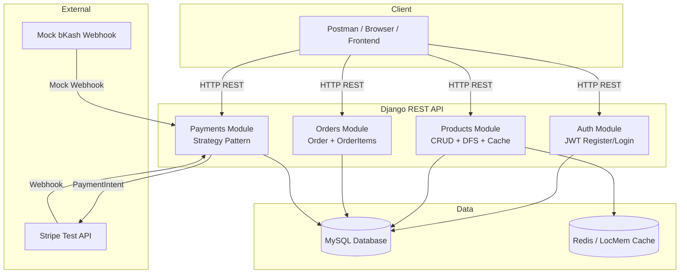
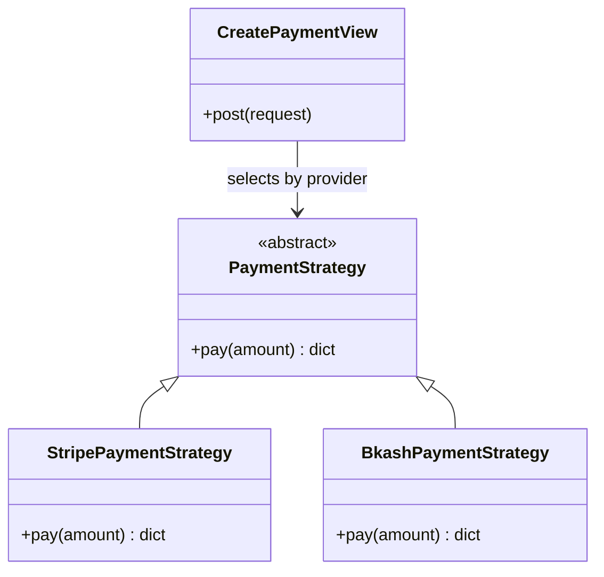
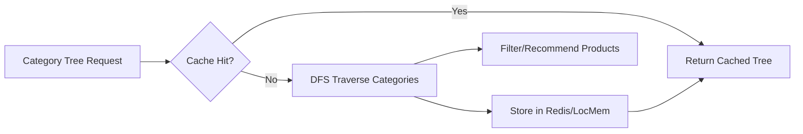
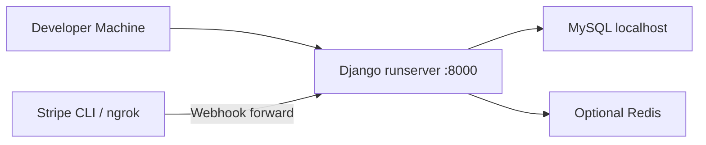

# System Architecture

## High-Level Architecture



## Application Structure

```
ecommerce-ordering-payment-system/
├── config/              # Project settings, root URLs
├── users/               # Custom User model, JWT auth
├── products/            # Products, Categories, DFS, recommendations
├── orders/              # Orders, OrderItems
├── payments/            # Payments, Strategy pattern, webhooks
└── docs/                # Documentation (ERD, architecture, API)
```

## Design Patterns

### Strategy Pattern (Payments)



The payment view selects a strategy based on `provider` (`stripe` or `bkash`) without modifying order logic.

### DFS + Caching (Products)



- **DFS** traverses the category hierarchy to find all child categories.
- **Cache** stores category tree results to reduce database queries.
- Used for product filtering by category and product recommendations.

## Technology Stack

| Layer | Technology |
|-------|------------|
| Framework | Django 6 + Django REST Framework |
| Authentication | JWT (SimpleJWT) |
| Database | MySQL |
| Cache | Redis (optional) / LocMem fallback |
| Payments | Stripe Test API + Mock bKash |
| Environment | python-dotenv |

## Security

- JWT tokens required for orders and payments
- Admin role required for product create/update/delete
- Stripe API keys stored in `.env` (not committed)
- Webhook endpoints exempt from CSRF (provider callbacks)

## Deployment (Local)



**Note:** Docker deployment was attempted but not completed. The project runs locally with `python manage.py runserver`. Webhooks can be tested using Stripe CLI or ngrok.

## Data Flow Summary

1. User registers and logs in → receives JWT access token
2. User browses products (public read)
3. User creates order with items → total calculated
4. User initiates payment → strategy creates payment record
5. Provider confirms (Stripe webhook / bKash mock webhook)
6. Order marked paid → stock reduced atomically
