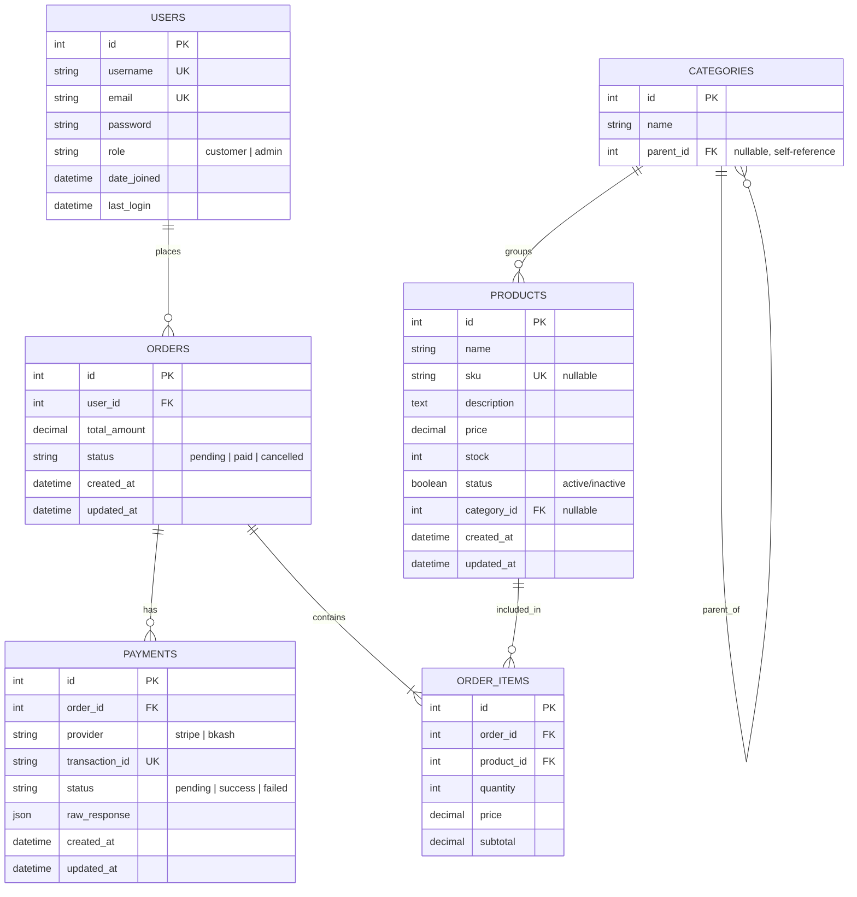

# Entity Relationship Diagram (ERD)

This document describes the database schema for the E-commerce Ordering & Payment System.

## ERD Diagram

## Relationships

| From | To | Type | Description |
|------|-----|------|-------------|
| User | Order | One-to-Many | A user can place many orders |
| Order | OrderItem | One-to-Many | An order contains multiple line items |
| Product | OrderItem | One-to-Many | A product can appear in many order items |
| Order | Payment | One-to-Many | An order can have payment attempts |
| Category | Category | Self-referential | Parent/child category hierarchy |
| Category | Product | One-to-Many | A category groups many products |

## Indexed / Unique Fields

| Table | Field | Constraint |
|-------|-------|------------|
| Users | email | UNIQUE |
| Users | username | UNIQUE |
| Products | sku | UNIQUE |
| Payments | transaction_id | UNIQUE |

## Status Values

### Order.status
- `pending` — order created, awaiting payment
- `paid` — payment confirmed, stock reduced
- `cancelled` — order cancelled

### Payment.status
- `pending` — payment initiated, awaiting confirmation
- `success` — payment confirmed
- `failed` — payment failed

### Payment.provider
- `stripe` — Stripe PaymentIntent (test mode)
- `bkash` — Mock bKash sandbox simulation

## Notes

- **OrderItem.price** and **OrderItem.subtotal** are stored at order time (price snapshot).
- **Payment.raw_response** stores the full provider response as JSON.
- **Category.parent** enables hierarchical product categorization for DFS traversal.
