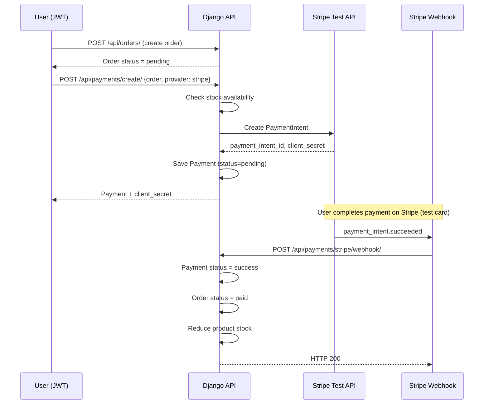
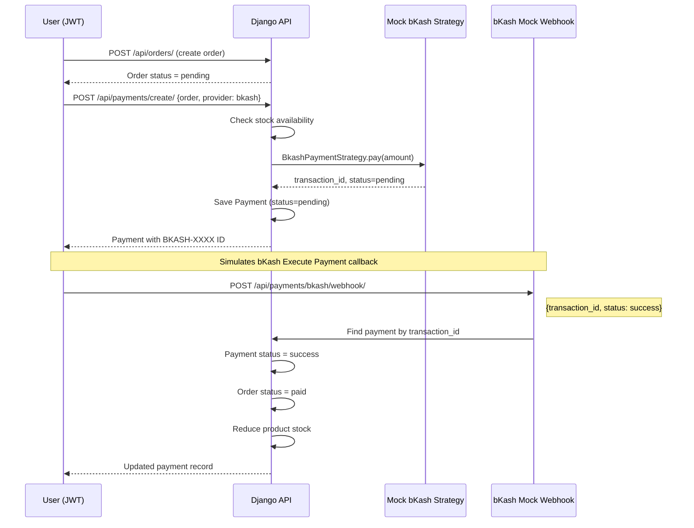
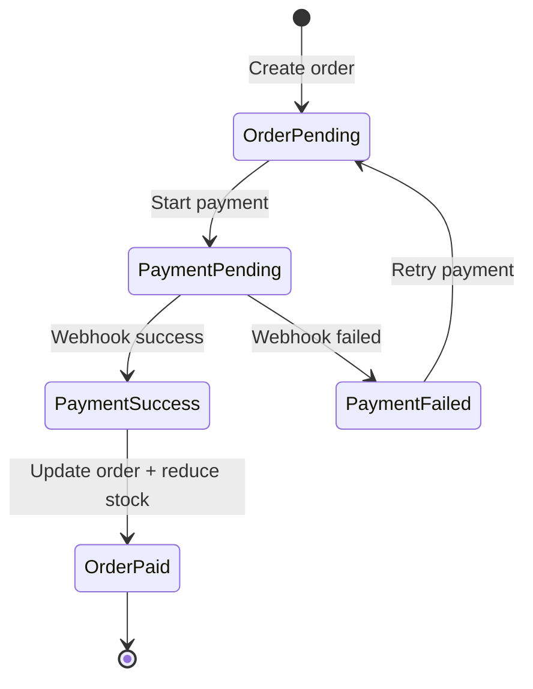

# Payment Flow Diagrams

## Stripe Payment Flow (Test Mode)



### Stripe Test Setup

```bash
stripe login
stripe listen --forward-to http://127.0.0.1:8000/api/payments/stripe/webhook/
stripe trigger payment_intent.succeeded
```

### Test Card
- Number: `4242 4242 4242 4242`
- Any future expiry, any CVC

---

## bKash Mock Payment Flow (Sandbox Simulation)

> **Note:** Real bKash sandbox/live APIs require a bKash merchant account. This project implements a mock flow that mirrors the real checkout → execute → confirm pattern using the Strategy Pattern.



### Mock bKash Webhook Example

```http
POST /api/payments/bkash/webhook/
Content-Type: application/json

{
    "transaction_id": "BKASH-XXXXXXXXXXXX",
    "status": "success"
}
```

To simulate failure:

```json
{
    "transaction_id": "BKASH-XXXXXXXXXXXX",
    "status": "failed"
}
```

---

## Complete Order Lifecycle



## Stock Management Rules

| Stage | Action |
|-------|--------|
| Order create | Validate stock >= quantity for each item |
| Payment create | Re-check stock before initiating payment |
| Payment success | Atomically reduce stock (webhook handler) |
| Payment failed | Stock unchanged |

Stock is **never** reduced until payment status becomes `success`.
